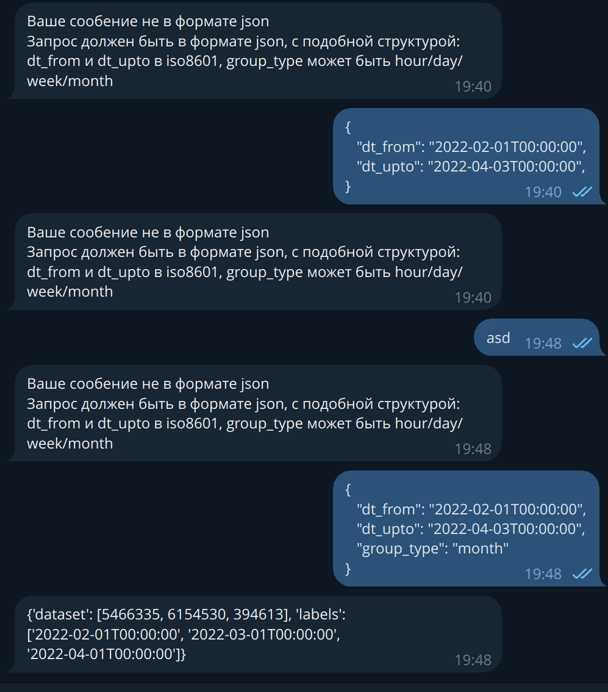

###

## Привет! Это тестовое задание, реализующее RESTful API с использованием aiogram и MongoDB. 

### Как работает:

Принимает данные в формате json. Аггрегация доступна по часу, дню, неделе и месяцу. dt_from и dt_upto принимают и отдают данные в формате ISO 8601(output для week отдает данные в формате year-week, e.g. '2022-40')

Пример ввода:

{
   "dt_from": "2022-02-01T00:00:00",
   "dt_upto": "2022-04-03T00:00:00",
   "group_type": "month"
}

Пример вывода:

{
    'dataset': [5466335, 6154530, 394613], 
    'labels': ['2022-02-01T00:00:00', '2022-03-01T00:00:00', '2022-04-01T00:00:00']
}

### Setup & start:

1. Clone repo: git clone {}
2. Create venv: python -m venv ./venv
3. Run venv: source ./venv/bin/activate
4. Download depends: pip install > requirements.txt
5. Rename .env.my to .env and configure it

6. Start by: cd /code & python main

### Demo:

### Depends:

The main libraries and techs used: 

1. aiogram for Telegram: https://docs.aiogram.dev/en/latest/
2. motor as async adapter for MongoDB: https://motor.readthedocs.io/en/stable/api-tornado/motor_client.html
3. MongoDB v7.0: https://www.mongodb.com/docs/manual/
4. python v3.12.4

The source file for db collection is available by this link: https://drive.google.com/file/d/1pcNm2TAtXHO4JIad9dkzpbNc4q7NoYkx/view?usp=sharing

## Author:

https://github.com/gb02002
